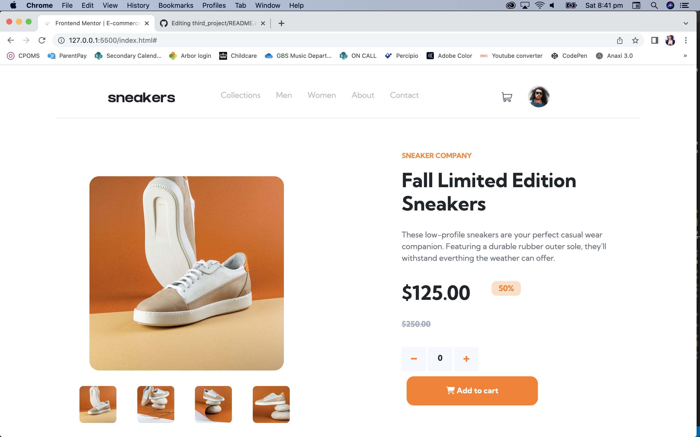

# Frontend Mentor - E-commerce product page solution

This is a solution to the [E-commerce product page challenge on Frontend Mentor](https://www.frontendmentor.io/challenges/ecommerce-product-page-UPsZ9MJp6). Frontend Mentor challenges help you improve your coding skills by building realistic projects.

## Table of contents

- [Overview](#overview)
  - [The challenge](#the-challenge)
  - [Screenshot](#screenshot)
  - [Links](#links)
- [My process](#my-process)
  - [Built with](#built-with)
  - [deployment] (#deployment)
  - [What I learned](#what-i-learned)
  - [Continued development](#continued-development)
  - [Useful resources](#useful-resources)
  - [Validation](#validation)
- [Acknowledgments](#acknowledgments)

## Overview

For this project, I needed to create an E-commerce product landing page featuring "fall limited edition sneakers". I was provided with the design, the images I needed and a basic style guide outlining the fonts and colours I needed to use. 

### The challenge

Users should be able to:

- View the optimal layout for the site depending on their device's screen size
- See hover states for all interactive elements on the page
- Open a lightbox gallery by clicking on the large product image
- Switch the large product image by clicking on the small thumbnail images
- Add items to the cart
- View the cart and remove items from it

### Screenshot

### Links

- Solution URL: [Add solution URL here](https://your-solution-url.com)
- Live Site URL: [Add live site URL here](https://your-live-site-url.com)

## My process

- I began by outlining the main sections I needed. I then worked on the nav (however ended up reworking it much later)
- After a basic layout I then worked on the cart and added the functionality in javascript 
- I then spent a whole day (gahhhhhhh!!!) on the lightbox layout 
- I then reworked the main landing page gallery and info and completley redid it 
- I redid the navbar and FINALLY got it looking as I should using a handy tutorial 
- I then focussed on making everything look pretty and the media queries
- Next was the lightbox functionality 
- And then just the last finishing touches! 

### Built with

- Semantic HTML5 markup
- CSS3
- Bootstrap 4
- Flexbox
- Javascript

## Deployment

I deployed to Github pages with the following process:

- Created a branch called gh-pages in the mac app
- Pushed latest code to that branch 

### What I learned

The biggest thing I learned was to make everything functional before focussing on making it look good. But then I got really stuck trying to make it look good! My biggest challenge (and still continues to be) is getting everything to align as it should. For example, originally I really struggled to get the gallery to look as it should and ended up overcomplicating it with lots of bootstrap rows and columns and as a result, nothing sat as it should. I ended up redoing everything, stripping it back (less divs) and it worked much better.
I also learned that while Bootstrap is very useful, it's not always the best choice when you need to make something look a particular way. Originally I used a nav component and then found it was too constricting and I couldn't get it to look how it looked in the brief. I ended up using plain CSS and Javascript to make it responsive and wish I'd done it right from the beginning as it was much quicker in the end!
The most useful part of this project was learning about how to make classes active and inactive with javcascript which is what I used for the lightbox, cart and the responsive nav.

### Continued development

Javascript is definitely my weakest area, I get very confused with syntax. I'm also still not good as positioning elements using CSS and need to have a deeper understanding of how to use CSS grids. 

### Useful resources

- codepen.io - This was a really useful sandbox for me to try ideas and concepts out 
- (https://www.youtube.com/watch?v=GdrbE-s5DgQ&t=532s) - This tutorial was excellent for helping me get the nav looking as it should 

### Validation

- https://codebeautify.org/jsvalidate for JS Validation. 

It threw 2 errors but I didn't understand what they meant so I left them there!!

- https://jigsaw.w3.org/css-validator/ for CSS. A couple of little syntax errors in this but easily fixed.

- https://validator.w3.org/ for HTML. This threw up about 50 errors and gave me a heart attack. Until I realised I hadn't included an Alt"" in any of my images (oops). There were also a couple of rogue divs which were easily deleted. However a rogue div still remains in the lightbox, because even though apparently it is a closing div without an opening, when I delete it the lightbox buttons go flying all over the page. I haven't worked that one out..

## Acknowledgments

My husband Jeff for helping me with the javascript and talking through the logic I needed. I definitely learnt a lot of useful things and feel confident recreating a similar project in the future. Check him out at https://github.com/jefframos 

This tutorial: (https://www.youtube.com/watch?v=GdrbE-s5DgQ&t=532s)

Google Fonts and Font Awesome!

W3 schools for always having helpful solutions and of course, google 

My mentor Scott for being a hero! 
